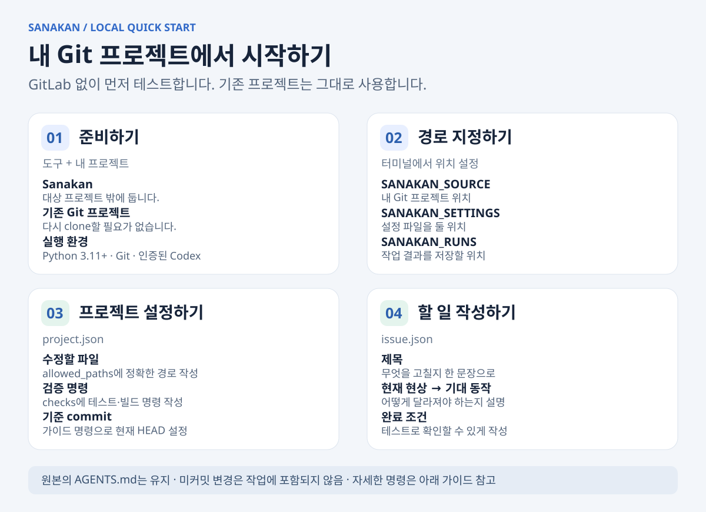
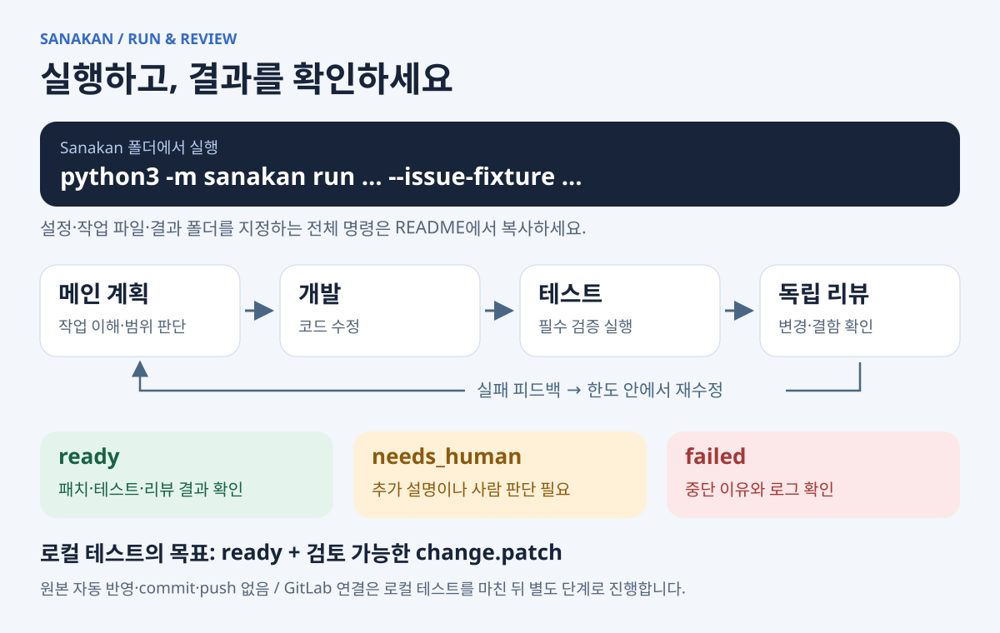

# Sanakan — Codex 에이전트 협업 자동화 코딩 도구

**개발 버전 1.5.0 · 2026-09-22**

Sanakan은 GitLab 이슈를 받아 Codex 에이전트가 계획·개발·검증·독립 리뷰를 수행하고,
Draft MR을 생성해 사람에게 리뷰를 요청하는 도구를 개발하는 프로젝트입니다.
기존 개발 운영 가이드와 템플릿은 이 도구의 정책·설정 기반으로 유지합니다.

## 자동 개발 시작하기

**한 번 설정하면, 새 이슈를 주기적으로 확인해 개발하고 Draft MR까지 생성합니다.**

1. [격리 실행과 결과 전달](docs/EXECUTION_BOUNDARY.md)을 준비하고 [자동화 설정 예시](examples/runner/automation-project.json)에 대상 프로젝트·허용 범위·검증·리뷰어와 형식 정책을 지정합니다.
2. 개발 전용 환경에서 `start --role develop`으로 감시를 시작합니다.
3. 별도 게시 환경에서 `start --role publish`로 완료 결과의 MR 게시를 시작합니다.
4. 이후에는 이슈를 등록하고 생성된 MR을 리뷰합니다. `status`, `stop`, `retry`로 관리합니다.

```text
주기적 이슈 확인 → 작업 브랜치 → Codex 개발·테스트·독립 리뷰
                                              ↓
사람 리뷰 요청 ← 형식에 맞는 Draft MR ← 검증된 커밋 게시
```

브랜치·커밋·MR 형식은 프로젝트 설정으로 정하고 게시 후에도 검사합니다.
MCP 없이 Codex 스킬이 CLI를 호출하는 플러그인 패키지도 제공합니다.
**[자동화 설정·운영 및 Codex 연결 가이드](docs/AUTOMATION.md)**

아래 그림은 자동화 연결 전에 기존 로컬 Git 프로젝트에서 작은 작업을 테스트하는 절차입니다.

## 그림으로 보는 설치와 사용

**이미 로컬에 있는 Git 프로젝트로 시작합니다. GitLab 계정이나 토큰은 필요 없습니다.**
실제 개발을 수행할 Codex 인증과 프로젝트의 빌드·테스트 도구는 준비되어 있어야 합니다.

### 1. 설치와 설정



준비할 파일은 두 개입니다.

| 파일 | 내가 작성할 내용 |
|---|---|
| `project.json` | 대상 프로젝트, 수정할 파일, 테스트·빌드 명령 |
| `issue.json` | 무엇을 고칠지, 어떤 결과가 나오면 완료인지 |

**처음이라면 [설치 가이드의 1~2단계](docs/INSTALL_LOCAL.md#1-경로-지정하기)를 따라 설정 파일을 만드세요.**
가이드에는 그대로 복사할 명령과 직접 바꿀 값이 구분되어 있습니다.
대상 프로젝트에 Sanakan을 복사하거나 기존 `AGENTS.md`를 수정할 필요는 없습니다.

### 2. 실행과 결과 확인



설치 가이드에서 경로와 설정을 준비한 **같은 터미널**, Sanakan 폴더에서 실행합니다.

```sh
env -u SANAKAN_READ_TOKEN -u SANAKAN_PUBLISH_TOKEN \
  python3 -m sanakan run \
  --config "$SANAKAN_SETTINGS/project.json" \
  --issue https://local.invalid/local/project/-/issues/1 \
  --issue-fixture "$SANAKAN_SETTINGS/issue.json" \
  --runs "$SANAKAN_RUNS"
```

`--issue-fixture`는 GitLab 대신 로컬 작업 파일을 읽는 옵션입니다. URL은 로컬 식별자이므로 그대로 둡니다.

- **`ready`**: 최종 attempt의 `change.patch`, `verification.json`, `review.json`을 확인합니다.
- **`needs_human`**: `state.json`의 `reason`과 `questions`를 확인합니다.
- **`failed`**: 중단 이유와 해당 attempt의 로그를 확인합니다.

원본 프로젝트의 현재 commit을 별도로 복제해 작업합니다. 미커밋 변경은 포함되지 않으며,
원본 반영·commit·push도 자동으로 하지 않습니다. 첫 테스트는 **`ready`와 변경 내용을 확인하면 완료**입니다.

[전체 설치 가이드와 문제 해결](docs/INSTALL_LOCAL.md) · [다음 단계: GitLab 연결](docs/RUNNER.md)

## 현재 구현 범위

- `watch` / `start`: 주기적 이슈 조회 또는 ready 결과 게시. 개발·게시 역할별 프로세스.
- `status` / `stop` / `retry`: 상태 확인, 협조적 중지, 기록을 보존하는 재시도.
- `run` / `publish`: 기존 단일 이슈 실행·게시도 유지.
- `publication`: 작업 브랜치·커밋 메시지·MR 제목/본문 템플릿과 실제 게시 결과 검사.
- `plugins/sanakan`: Codex 관리 스킬과 CLI runtime을 묶는 플러그인 배포 소스.

임시 Git 저장소에서 실제 Codex 개발·검증·리뷰를 확인했습니다. Docker 실행 및 실제 GitLab 실증은 아직 미수행입니다.
자동 게시에는 Docker 격리 실행과 signed 결과 전달이 필요하며, 로컬 개발 결과는 게시할 수 없습니다.
Webhook, 다중 호스트 분산 실행, 사람 리뷰 댓글 기반 후속 수정, 자동 병합은 후속 범위입니다.

## 로컬 검증

아래 검증은 모델·원격 API·토큰 없이 임시 Git 저장소에서 실행됩니다.

```sh
PYTHONDONTWRITEBYTECODE=1 python3 -m unittest discover -s tests -v
python3 tools/validate_package.py
```

실제 테스트 프로세스와 Git 변경을 사용하며 Codex/GitLab 응답은 모의 처리합니다.
통과가 실제 모델 품질, GitLab 권한 또는 운영 환경 격리 검증을 의미하지는 않습니다.

## 저장소 구성

| 경로 | 역할 |
|---|---|
| `sanakan/` | 실행 조정, Codex 어댑터, GitLab API, 별도 게시기 |
| `tests/` | 패치/gate 및 실행기·게시기 오프라인 회귀 검증 |
| `templates/automation/` | 보호된 patch 수집·gate·schema·프롬프트 |
| `templates/` | 소비자 프로젝트에 선택 적용하는 운영 정책 |
| `docs/` | 실행 명세, 사용법, 프로젝트 도입 안내 |
| `tools/` | 패키지 검증 및 ZIP 생성 |

`templates/automation/publish-branch-and-mr.sh`는 이전 참조 템플릿의 차단 stub으로 남아 있습니다.
새 게시 구현은 `sanakan/publisher.py`이며 동일 기능으로 혼동하지 마세요.

## 가이드와 배포

- [신규 프로젝트](01_NEW_PROJECT_CHECKLIST.md) / [기존 프로젝트](02_EXISTING_PROJECT_CHECKLIST.md)
- [보안 체크리스트](03_SECURITY_CHECKLIST.md) / [단계별 도입](docs/ROLLOUT_CHECKLIST.md)
- [Studio 적용 안내](docs/STUDIO_ADOPTION.md) — 이전 조사 기반이며 실제 적용 시 재확인
- [참조 검증 도구](templates/automation/README.md)
- [검증 기록](VALIDATION.md) / [변경 이력](CHANGELOG.md) / [게시 안내](PUBLISHING.md)

소스와 배포 파일의 일치는 MANIFEST/SHA256SUMS로 검사합니다. 코드 변경 후 검토·테스트를 수행하고
`python3 tools/validate_package.py --refresh`로 목록을 갱신합니다.
플러그인 ZIP은 `python3 tools/build_plugin.py --output <저장소-밖의-ZIP>`으로 생성합니다.
